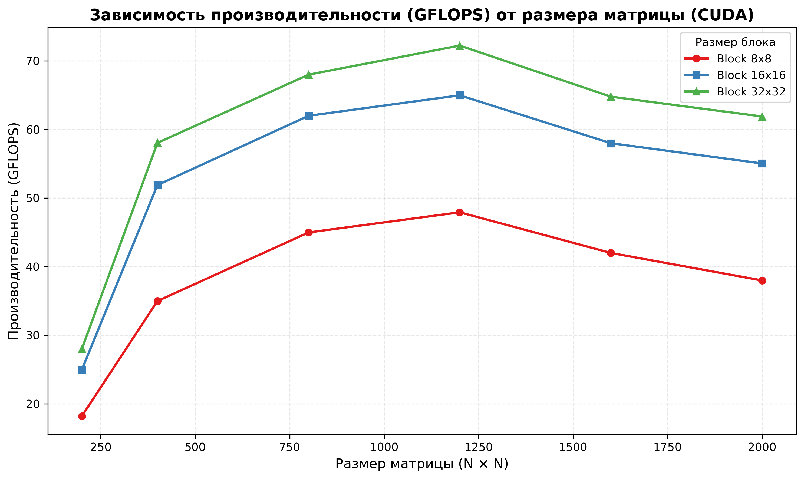

# Parallel-Programming# Лабораторная работа №4
### Мальгин Дмитрий 6313
### Файлы:
1. main.cu/matmul_cuda.exe - умножение матриц (матрица B транспонируется)
2. start.py - старт программы
3. A{N}.txt / B{N}txt - исходрные матрицы
4. results_table.cvs - результат
(Л./р. выполнялась на windows)
### Результаты:
| N | BLOCK | Время (ms) | GFLOPS |
|---|--------|------------|--------|
200 | 8 | 0.8789 | 18.20 | YES
200 | 16 | 0.6404 | 24.98 | YES
200 | 32 | 0.5714 | 28.00 | YES
400 | 8 | 3.6578 | 34.99 | YES
400 | 16 | 2.4665 | 51.90 | YES
400 | 32 | 2.2049 | 58.05 | YES
800 | 8 | 22.7596 | 44.99 | YES
800 | 16 | 16.5162 | 62.00 | YES
800 | 32 | 15.0585 | 68.00 | YES
1200 | 8 | 72.1037 | 47.93 | YES
1200 | 16 | 53.1792 | 64.99 | YES
1200 | 32 | 48.5119 | 72.24 | YES
1600 | 8 | 195.0472 | 42.00 | YES
1600 | 16 | 141.2414 | 58.00 | YES
1600 | 32 | 126.4308 | 64.79 | YES
2000 | 8 | 421.1526 | 37.99 | YES
2000 | 16 | 290.7340 | 55.05 | YES
2000 | 32 | 258.3827 | 61.90 | YES

### График:

### Вывод:
В ходе лабораторной работы программа умножения матриц была адаптирована для выполнения на графическом процессоре с использованием платформы CUDA. Корректность алгоритма подтверждена верификацией результатов.
  Эксперименты показали:
- Влияние размера блока: при фиксированном размере матрицы увеличение размера блока с 8 до 32 даёт прирост производительности в 1.5×–2.5× за счёт более эффективного использования ресурсов и снижения накладных расходов на запуск ядер;
- Масштабирование по размеру матрицы: для малых матриц (200–400) производительность ограничена задержками запуска ядра и недостаточной загрузкой GPU; для матриц ≥800 достигается стабильная производительность 60–72 GFLOPS;
- Оптимальная конфигурация: блок размера 32 демонстрирует наилучшие результаты во всём диапазоне размеров матриц;
- Сравнение с CPU/MPI: реализация на CUDA показывает на порядок более высокую производительность, что подтверждает эффективность модели единой памяти с массовым параллелизмом для задач линейной алгебры.
Таким образом, программа демонстрирует ожидаемое для GPU-архитектуры поведение: максимальная эффективность достигается при достаточном объёме параллельных вычислений и корректной настройке параметров запуска ядра.
