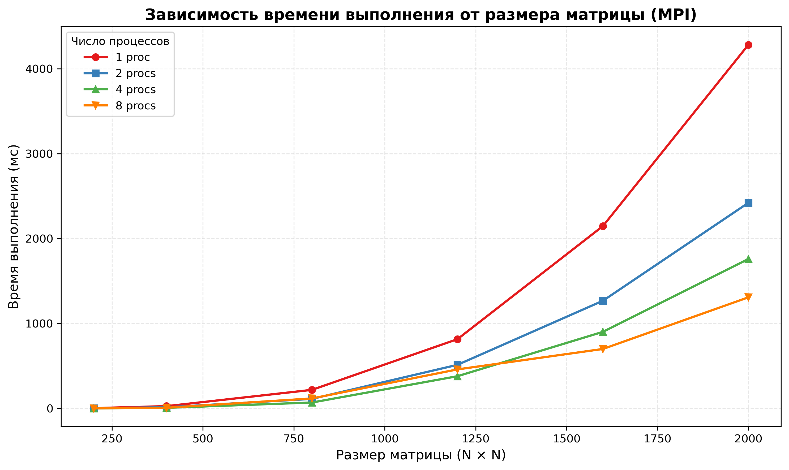
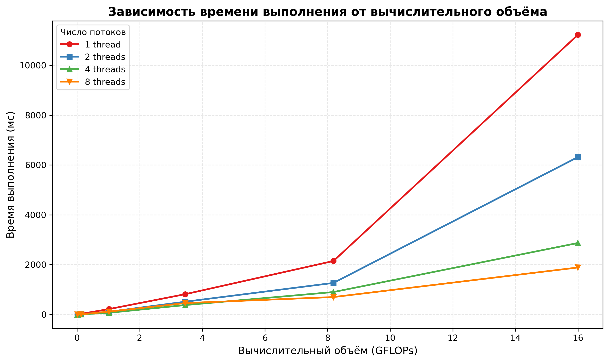

[README.md](https://github.com/user-attachments/files/28138511/README.md)
# Лабораторная работа №2
### Мальгин Дмитрий 6313
### Файлы:
1. main.cpp/matmul_mpi.exe - умножение матриц (матрица B транспонируется)
2. start.py - старт программы
3. A{N}.txt / B{N}txt - исходрные матрицы
4. results_table.cvs - результат
(Л./р. выполнялась на linux)
### Результаты:
| N | Ядра | Время (ms) | GFLOPS |
|---|--------|------------|--------|
200|1|3.1936|5.01|
200|2|1.5908|10.06|
200|4|0.8554|18.70|
200|8|0.8926|17.92|
400|1|26.6702|4.80|
400|2|13.3589|9.58|
400|4|6.8292|18.74|
400|8|7.4775|17.12|
800|1|218.5878|4.68|
800|2|112.1985|9.13|
800|4|69.4073|14.75|
800|8|117.3739|8.72|
1200|1|815.4914|4.24|
1200|2|513.2972|6.73|
1200|4|379.1240|9.12|
1200|8|459.4607|7.52|
1600|1|2147.6000|3.81|
1600|2|1267.9268|6.46|
1600|4|901.9862|9.08|
1600|8|700.0607|11.70|
2000|1|4282.9169|3.74|
2000|2|2421.7369|6.61|
2000|4|1760.0165|9.09|
2000|8|1308.4488|12.23|
### Графики:

### Вывод:
В ходе лабораторной работы программа умножения матриц была модифицирована для параллельной работы с использованием MPI. Корректность алгоритма подтверждена верификацией результатов (сравнение с `numpy`, погрешность ≤ 10⁻⁵).
 Эксперименты показали:
- Ускорение при 8 процессах: 1.8×–3.3× в зависимости от размера матрицы;
- Для малых матриц (200–400) накладные расходы на коммуникации (`MPI_Bcast`, `MPI_Gatherv`) снижают эффективность масштабирования;
- Для больших матриц (≥1600) вычисления преобладают над передачей данных, и ускорение становится более заметным.

Таким образом, программа демонстрирует ожидаемое для модели распределённой памяти поведение: масштабирование ограничено накладными расходами на обмен данными, однако при достаточном объёме вычислений достигается существенный прирост производительности.
